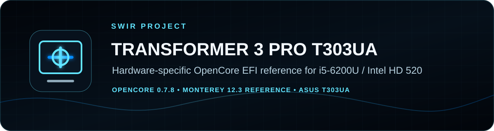
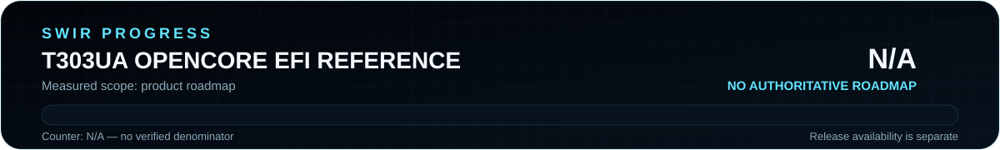

<!-- SWIR-README-STANDARD:v2 -->

<div align="center">



<br>


[](https://github.com/Swir)
[](https://github.com/Swir/Transformer-3-Pro-T303UA-i5-6200-hackintosh/stargazers)

<br>

[**Highlights**](#-highlights) · [**Before Use**](#-before-use) · [**Progress**](#-progress) · [**Release**](#-release) · [**Limitations**](#-limitations--legal-notes)

</div>

# ASUS Transformer 3 Pro T303UA OpenCore EFI Reference

A hardware-specific **OpenCore EFI reference** for the ASUS Transformer 3 Pro T303UA configuration documented with Intel Core i5-6200U and Intel HD Graphics 520. The repository contains an EFI tree and a published reference package associated with OpenCore 0.7.8 and macOS Monterey 12.3.


## 📍 Project Status

<p align="center">
  
</p>

| Item | Status |
|---|---|
| Current stage | Hardware-specific EFI reference / snapshot |
| Target hardware | ASUS Transformer 3 Pro T303UA, i5-6200U, Intel HD Graphics 520 |
| Documented combination | OpenCore 0.7.8 + macOS Monterey 12.3 |
| Latest public release | `T303UA` |
| Product roadmap | No authoritative measurable roadmap; product progress is **N/A** |

## 🚀 Overview

This repository is intended as a **reference starting point for this exact hardware family**, not as a universal EFI and not as a promise that every device revision, firmware version, macOS release or peripheral will work unchanged.

The repository currently includes an `EFI/BOOT` and `EFI/OC` layout with OpenCore configuration components such as ACPI data, drivers, kexts, resources, tools and `config.plist`. Users should inspect and adapt the configuration for their own device rather than copying identity data or assuming compatibility.

## ✨ Highlights

| Area | What is present |
|---|---|
| 💻 Device-specific reference | Configuration is documented for ASUS Transformer 3 Pro T303UA hardware |
| 🥾 OpenCore EFI structure | Repository includes `EFI/BOOT` and `EFI/OC` content |
| 🧩 OpenCore components | ACPI, drivers, kexts, resources, tools and configuration are present in the EFI tree |
| 📦 Published package | A real `T303UA` GitHub Release contains the reference EFI archive |
| ⚠️ Conservative compatibility | README treats the documented Monterey/OpenCore combination as a reference, not universal support |

## 📁 Repository Layout

```text
Transformer-3-Pro-T303UA-i5-6200-hackintosh/
├── EFI/
│   ├── BOOT/
│   └── OC/
├── assets/
│   └── readme/
├── tools/
└── README.md
```

The EFI tree also contains metadata files originating from the source filesystem. They are part of the existing repository state and are not presented here as required OpenCore components.

## ⚙️ Before Use

### Recommended path

1. Back up your current working EFI and recovery path.
2. Download or clone this repository only as a **reference** for the documented T303UA hardware.
3. Review `EFI/OC/config.plist`, ACPI, kexts and drivers before booting.
4. Generate and use your **own appropriate SMBIOS/identity values**; do not blindly reuse identifiers from another machine.
5. Confirm BIOS/UEFI settings, storage/recovery access and device-revision compatibility.
6. Verify USB mapping and any hardware-specific changes needed for your own unit.

### Clone the repository

```bash
git clone https://github.com/Swir/Transformer-3-Pro-T303UA-i5-6200-hackintosh.git
cd Transformer-3-Pro-T303UA-i5-6200-hackintosh
```

This repository does not provide macOS installation media.

## 📋 Hardware / Compatibility Reference

| Component | Documented value |
|---|---|
| Model | ASUS Transformer 3 Pro T303UA |
| CPU | Intel Core i5-6200U 2.30 GHz |
| GPU | Intel HD Graphics 520 |
| RAM | 4 GB DDR3 |
| Bootloader reference | OpenCore 0.7.8 |
| macOS reference | Monterey 12.3 |

These values describe the repository's documented reference configuration. Compatibility with newer OpenCore/macOS versions, different T303UA revisions, Wi-Fi modules, peripherals or firmware is **not verified by this README**.

## 🧠 Technology / Configuration

| Layer | Role |
|---|---|
| UEFI boot | OpenCore EFI layout |
| Configuration | `EFI/OC/config.plist` |
| Platform support | Hardware-specific ACPI, drivers and kexts in the existing EFI tree |
| Recovery approach | Keep a known-good EFI backup and a bootable recovery path before changes |

## 🗺️ Progress

<p align="center">
  
</p>

Product completion is **N/A** because the repository does not contain an authoritative roadmap with a measurable verified denominator. A published EFI snapshot is not equivalent to `100%` product completion. The local SVG validator is:

```bash
python tools/generate_readme_progress.py --check
```

## 📦 Release

A public GitHub Release named **Transormer 3 Pro T303UA i5 6200U** is published under tag `T303UA` and contains:

`Transformer.3.Pro.T303UA.i5-6200U.EFI.OC7.8.MONTEREY.12.3.zip`

Published asset SHA-256:

```text
991aed6fc7c4bd481c37feb7cc04e93b92ba2e1e42f91434fe959b58ba1ae39f
```

[**GitHub Release →**](https://github.com/Swir/Transformer-3-Pro-T303UA-i5-6200-hackintosh/releases/tag/T303UA)

## ⚠️ Limitations / Legal Notes

- This is a hardware-specific reference, not a universal Hackintosh/OpenCore configuration.
- Back up the current EFI and maintain a recovery method before changing boot files.
- Do not reuse another machine's private platform identity values; generate values appropriate for your own system.
- The repository does **not** distribute macOS. Obtain Apple software through lawful sources and review Apple's applicable license terms for your intended use.
- OpenCore, kexts and other bundled third-party components may have their own upstream licenses and support policies; review them before redistribution or modification.
- No top-level repository license is claimed here unless one is actually added to the repository.

## 🔎 Search Keywords

`ASUS T303UA OpenCore` • `Transformer 3 Pro EFI` • `T303UA Hackintosh reference` • `i5-6200U OpenCore` • `Intel HD 520 EFI` • `Skylake OpenCore configuration` • `Monterey 12.3 EFI` • `OpenCore 0.7.8 reference` • `ASUS Transformer 3 Pro Hackintosh` • `T303UA EFI configuration`


<div align="center">

### `BACK UP • REVIEW • ADAPT • VERIFY`

⭐ **If this hardware reference is useful, consider leaving a star.**

[**← SWIR profile**](https://github.com/Swir) · [**All projects →**](https://github.com/Swir?tab=repositories)

</div>
